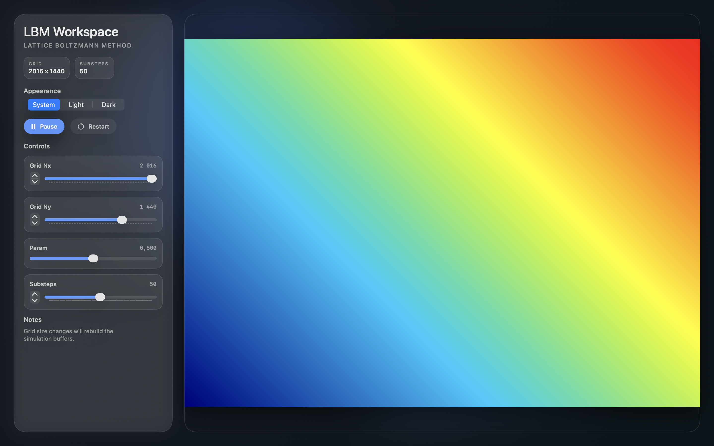
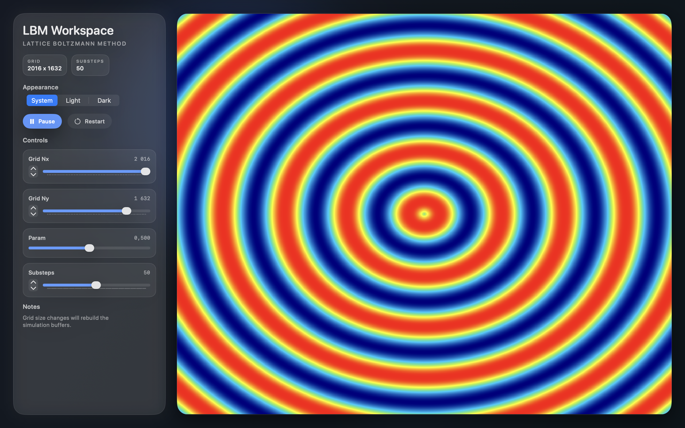

# Eulerian Physic Simulation Template (EPST) Tutorial

EPST is a starter template for **grid-based GPU simulations** on macOS using **Metal + SwiftUI**.

It gives you a complete loop out of the box:
- a compute pass that updates one value per cell,
- a render pass that visualizes that value in real time,
- a SwiftUI panel to tweak grid size and simulation parameters.

The current default simulation is intentionally minimal: each cell stores `x + y` and is displayed through a color gradient.

## Preview

### Basic template look



## Quick Start

```bash
open EPST.xcodeproj
```

In Xcode:
1. Select scheme `EPST`.
2. Press Run.

Optional CLI build:

```bash
xcodebuild -project EPST.xcodeproj -scheme EPST -configuration Debug build
```

Requirements:
- macOS with Metal support
- Xcode with SwiftUI + Metal toolchain

Note: `EPST.xcodeproj` currently sets `MACOSX_DEPLOYMENT_TARGET = 26.2`.

## How EPST Works

```text
SwiftUI (ContentView + ControlPanel)
  -> MTKView (MetalView)
    -> Renderer
      -> PhysicRenderPass   (compute shader writes grid values)
      -> GraphicRenderPass  (fragment shader reads grid values and colors pixels)
```

Per frame:
1. `Renderer.draw(...)` creates a `MTLCommandBuffer`.
2. `PhysicRenderPass.draw(...)` runs `substeps` compute iterations.
3. `GraphicRenderPass.draw(...)` draws the grid quad.
4. Drawable is presented.

Core GPU data:
- `Mesh { Nx, Ny }` in `EPST/Shaders/Common.h`
- `SimParams { param }` in `EPST/Shaders/Common.h`
- `informationBuffer` (`Float` per cell) in `EPST/Render/PhysicRenderPass.swift`

## First Hands-On Tutorial

Goal: replace the default `x + y` field with a radial-wave pattern controlled by `Param`.

### Step 1: Edit compute logic

File: `EPST/Shaders/Physic.metal`

Replace the compute body after `x`/`y` calculation with:

```metal
float nx = max(float(mesh.Nx - 1), 1.0);
float ny = max(float(mesh.Ny - 1), 1.0);

float2 uv = float2(float(x) / nx, float(y) / ny);
float2 center = float2(0.5, 0.5);
float r = distance(uv, center);

float frequency = 10.0 + params.param * 80.0;
float value = 0.5 + 0.5 * sin(r * frequency);

information[id] = value;
```

### Step 2: Match the fragment normalization

File: `EPST/Shaders/Fragment.metal`

Replace:

```metal
float informationNorm = information[idx] / (mesh.Nx + mesh.Ny);
float t = clamp(informationNorm, 0.0, 1.0);
```

With:

```metal
float t = clamp(information[idx], 0.0, 1.0);
```

### Step 3: Run and tune

1. Build and run.
2. Move `Param` in the control panel.
3. You should see ring spacing change live.



## Control Reference

Defaults are defined in `EPST/SwiftUI View/ContentView.swift`.

| Control | Range | Default | Runtime effect |
|---|---:|---:|---|
| `Grid Nx` | `32...2024` step `32` | `2016` | Rebuilds simulation buffer with new width |
| `Grid Ny` | `32...2024` step `32` | `736` | Rebuilds simulation buffer with new height |
| `Param` | `0.0...1.0` | `0.50` | Updates `SimParams.param` and resets simulation |
| `Substeps` | `1...100` | `50` | Compute iterations per rendered frame |
| `Play/Pause` | toggle | running | Stops/starts compute updates |
| `Restart` | action | - | Re-runs `initialize` kernel |
| `Appearance` | `System/Light/Dark` | `System` | UI only |

## Edit Map

| You want to change... | Edit this file |
|---|---|
| simulation equations | `EPST/Shaders/Physic.metal` |
| reset/initial conditions | `EPST/Shaders/Initialize.metal` |
| color mapping | `EPST/Shaders/Fragment.metal` |
| gradient palette stops | `EPST/Render/GraphicRenderPass.swift` |
| grid sizing and compute dispatch | `EPST/Render/PhysicRenderPass.swift` |
| render/compute orchestration | `EPST/Control/Renderer.swift` |
| default UI values | `EPST/SwiftUI View/ContentView.swift` |
| control widgets | `EPST/SwiftUI View/ControlPanel.swift` |
| shared Swift/Metal structs | `EPST/Shaders/Common.h` |

## Add Your Own Parameter

When one `param` is not enough:

1. Extend `SimParams` in `EPST/Shaders/Common.h`.
2. Update `SimParams(...)` creation in `EPST/Render/PhysicRenderPass.swift`.
3. Pass updated params from `EPST/Control/Renderer.swift`.
4. Add new `@State` and control binding in `EPST/SwiftUI View/ContentView.swift`.
5. Add the UI control in `EPST/SwiftUI View/ControlPanel.swift`.
6. Use the new field in `EPST/Shaders/Physic.metal` and/or `EPST/Shaders/Fragment.metal`.

## Project Map

- `EPST/Control/Renderer.swift`: command buffer lifecycle and pass orchestration
- `EPST/Control/Camera.swift`: orthographic camera
- `EPST/Render/PhysicRenderPass.swift`: compute pipelines, buffers, threadgroups
- `EPST/Render/GraphicRenderPass.swift`: render pipeline, uniforms, gradient texture
- `EPST/Render/Pipeline.swift`: PSO creation utilities
- `EPST/Shaders/Common.h`: shared ABI (buffer indices + structs)
- `EPST/Shaders/Initialize.metal`: reset kernel
- `EPST/Shaders/Physic.metal`: simulation kernel
- `EPST/Shaders/Vertex.metal`: grid quad positioning and UVs
- `EPST/Shaders/Fragment.metal`: value-to-color visualization
- `EPST/SwiftUI View/*`: UI layout, controls, and MTKView bridge